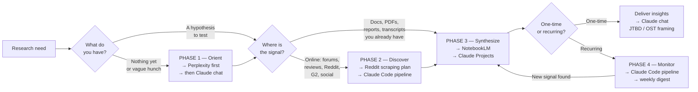

This skill diagnoses where you are in a research workflow and produces a concrete **Research Brief** — phase, tool stack, and sequenced action plan. If the user brings raw data (transcripts, scraped output, PDFs), route to `user-research-synthesis` instead — that skill is purpose-built for synthesis and produces richer, quote-grounded output.

---

## Required Inputs

Before producing a Research Brief, ask for:

- **Research question** in one sentence: what decision does this research need to support?
- **What you already have**: nothing, a hypothesis, raw data, documents, or a recurring need
- **Scope**: one-time snapshot or recurring monitoring
- **Domain**: product feedback, competitor analysis, user sentiment, market sizing, or trend tracking
- Any relevant context: company, product, target ICP, known competitors

---

## The Four Research Phases

### Phase 1 — Orient

**Goal:** Build working understanding fast. Generate hypotheses, learn terminology, identify key players.
**Entry:** Vague hunch, new domain, or blank slate.
**Exit:** 3–5 hypotheses worth testing.
**Tools:** Perplexity, Claude chat

---

### Phase 2 — Discover

**Goal:** Find raw signal from real people — complaints, workarounds, requests — from unfiltered sources.
**Entry:** Hypotheses to test against real data.
**Exit:** Raw quotes, patterns, or frequency data from actual sources.
**Tools:** Reddit/forum scraping (see scraping plan below), G2, Hacker News API

---

### Phase 3 — Synthesize

**Goal:** Extract themes, gaps, contradictions, JTBD, and opportunities from raw inputs.
**Entry:** Raw inputs — docs, transcripts, scraped data, PDFs.
**Exit:** Structured insights ready for decision-making (OST, JTBD, opportunity map).
**Tools:** NotebookLM (multi-doc corpus), Claude Projects (iterative), Claude chat (reframing)

---

### Phase 4 — Monitor

**Goal:** Surface new signal on a schedule without repeating manual effort.
**Entry:** At least one Discover–Synthesize cycle complete.
**Exit:** A pipeline that runs on a schedule and surfaces delta summaries.
**Tools:** Claude Code (scraping + digest pipeline), Claude Projects (persistent context)

---

## Decision Tree



---

## Tool-to-Phase Mapping

| Tool | Primary Phase | Strength | When NOT to use |
|---|---|---|---|
| **Perplexity** | Orient | Fast, cited, broad overview | Deep synthesis or custom corpus |
| **Claude chat** | Orient + Synthesize | Reasoning, reframing, JTBD extraction | Discovery — only knows what you feed it |
| **NotebookLM** | Synthesize | Cross-referencing 10–20 docs at once | Real-time discovery or live data |
| **Claude Projects** | Synthesize + Monitor | Persistent context, iterative refinement | First-pass discovery |
| **Reddit/forum scraping** | Discover | Unfiltered user signal at scale | When you already have the data |
| **Claude Code** | Discover + Monitor | Automates pipelines, builds scrapers | When a one-time manual pass is enough |

---

## Scraping Plan: Reddit and Forums with Claude Code

Claude Code can build and run scraping pipelines for unfiltered user signal. Use this for Phase 2 (Discover). Present this plan when the user needs to gather raw signal from online sources.

### Option A — Reddit JSON API (no credentials needed)

Reddit exposes public JSON on any URL by appending `.json`. No API key required.

**Ask Claude Code to build:**

```
Build a Python script that:
1. Takes a subreddit name and search query as inputs
2. Hits https://www.reddit.com/r/{subreddit}/search.json?q={query}&sort=relevance&limit=100
3. Extracts: post title, body, score, comment count, and top 3 comments per post
4. Saves to CSV with columns: source, date, title, text, score, url
5. Adds time.sleep(1) between requests to respect rate limits
```

**Useful subreddits by research type:**

| Research type | Subreddits |
|---|---|
| SaaS / B2B product feedback | r/SaaS, r/entrepreneur, r/startups, r/ProductManagement |
| Developer tools | r/webdev, r/programming, r/devops |
| Consumer products | r/frugal, r/buyitforlife, r/personalfinance |
| Competitor communities | r/{CompetitorName} — often the richest source |

**Rate limits:** 1 request/second. The `time.sleep(1)` call is mandatory or Reddit will block the script.

---

### Option B — PRAW (Python Reddit API Wrapper)

More powerful than the JSON API: pagination beyond 100 results, comment threading, date filtering. Requires a free Reddit app key.

**Setup:**
1. Go to reddit.com/prefs/apps → create app → select "script" type
2. Note your `client_id` and `client_secret`
3. Ask Claude Code: *"Build a PRAW script that searches r/[subreddit] for [keyword], extracts posts and top-level comments from the last 90 days, and saves to CSV"*

**When to use PRAW over the JSON API:** when you need more than 100 results, want comment threads, or need to filter by date range.

---

### Option C — Hacker News (Algolia API)

Free, no auth, excellent for tech and B2B signal. Covers "Ask HN", "Show HN", and comments.

```
https://hn.algolia.com/api/v1/search?query={keyword}&tags=comment&hitsPerPage=100
```

**Ask Claude Code to:** hit this endpoint, extract comment text and parent story title, filter by relevance score, save to CSV.

**Best for:** developer tooling, B2B SaaS, technical products, early adopter sentiment.

---

### Option D — G2 and Trustpilot

Requires BeautifulSoup scraping. Ask Claude Code:

```
Build a BeautifulSoup scraper for g2.com/products/{product-slug}/reviews
that extracts: review title, star rating, pros text, cons text, reviewer role and company size.
Respect robots.txt, add a 2-second delay between pages, rotate user-agent headers.
```

**Note:** G2 blocks scrapers aggressively. Limit to ~20 pages per session and use realistic user-agent strings. Trustpilot is more permissive.

---

### Synthesizing Scraped Output

Once you have a CSV, the user should paste representative rows into Claude and ask:

- "What are the top 5 pain points across these? Quote the most representative line for each."
- "Extract JTBD statements: what job is this person hiring the product to do?"
- "What complaints appear in the data that no competitor is addressing?"

For large datasets (500+ rows): load into NotebookLM or use Claude Projects with chunked uploads. Do not try to paste 1,000 rows into a single Claude chat window.

---

## Research Brief Output Format

When this skill runs without raw data provided, produce:

**Research Brief**

1. **Phase diagnosis** — which phase the user is in and why, in 2 sentences
2. **Recommended tool stack** — the 2–3 specific tools for this research question
3. **Sequenced action plan** — numbered steps in order (what to run first, what to do with the output, what comes next)
4. **Scraping setup** (if Phase 2 applies) — which Option (A/B/C/D) fits, and the exact ask to give Claude Code

If raw data is provided (transcripts, scraped output, PDFs), do not synthesize here. Route to `user-research-synthesis` instead — it produces contradiction mapping, evidence citation, and quote-grounded output.

---

## One-Line Heuristics

- No input yet → Perplexity first
- Have documents → NotebookLM or Claude Projects
- Need unfiltered user signal → Reddit JSON API (Option A) is the fastest start
- Need more than 100 Reddit posts → switch to PRAW (Option B)
- Need tech community signal → Hacker News Algolia API (Option C)
- Need product review data → G2 scraper (Option D)
- Need to think through implications → Claude chat
- Want it automated weekly → Claude Code pipeline feeding into Claude Projects
- Discovering + synthesizing together → discover first, then synthesize — never skip order

---

## Common Use Cases

**Competitive SaaS analysis**
Perplexity (orient) → scrape G2 + Reddit via Claude Code (discover) → Claude Projects (synthesize into OST or JTBD map)

**User pain point research**
Reddit JSON API or PRAW (discover) → paste top quotes into Claude chat (extract JTBD)

**Synthesizing existing reports and expert content**
Upload PDFs to NotebookLM → cross-reference themes → Claude chat (strategic reframe)

**Ongoing market monitoring**
Claude Code pipeline (weekly Reddit/HN scrape) → structured CSV → Claude Projects (delta summary vs. previous week)

**Fast one-off competitive snapshot**
Perplexity → paste competitor pages into Claude chat → JTBD and gap analysis output

---


## Gotchas

<!-- Add a line here each time this skill produces the wrong output or misses something important. Fill from real failures, not hypotheses. -->

---

## Progressive Updates

Whenever the user explicitly states not to do something (e.g. "don't ask for X", "stop doing Y", "never include Z"), automatically edit the role and behaviour description at the top of this SKILL.md to reflect that constraint permanently. This ensures the skill adapts to user preferences over time without requiring repeated instructions.
