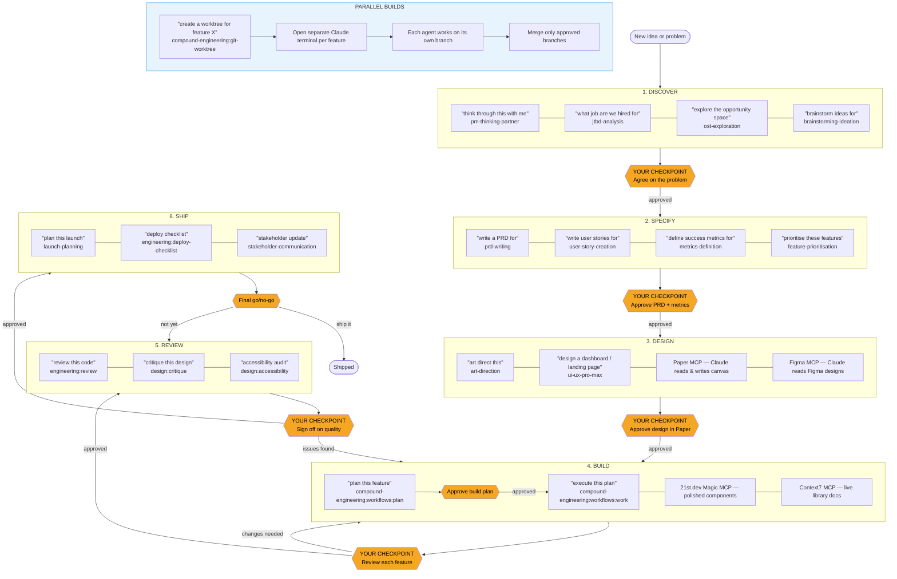

# Human-in-the-Loop Build Workflow

A complete map of skills, MCPs, and agent patterns for building products with Claude Code — with you as the decision-maker at every handoff.

---

## Scope Gate — Run This First

Before entering any phase, answer:

**Is this a prototype / script / single-file tool, or a real product feature with stakeholders?**

| Type | Path |
|---|---|
| Prototype, script, or single-file tool | Skip Discover, Specify, and Design. Go straight to Build. Document after it works. |
| Real product feature with stakeholders | Run the full 6-phase loop below. |

If unsure, ask: "Will anyone other than you use this, or does it need to survive beyond this session?" If no → prototype path.

---

## The Build Loop



Each phase ends with a human checkpoint (🟠). Claude presents output. You approve before the next phase begins.

---

## Phase Map

### 1. Discover
**Goal:** Agree on the problem before anything is written.

| Tool | Trigger |
|---|---|
| `pm-thinking-partner` | "think through this with me: [idea]" |
| `jtbd-analysis` | "what job are we hired for" |
| `ost-exploration` | "explore the opportunity space" |
| `brainstorming-ideation` | "brainstorm ideas for" |
| Granola MCP | Pull context from meeting notes automatically |
| Notion MCP | Capture output to Notion |

→ **Your checkpoint:** Agree on the problem and target outcome. Value check: Can you state the problem in one sentence?

---

### 2. Specify
**Goal:** A clear PRD and success metrics before any design or code.

| Tool | Trigger |
|---|---|
| `prd-writing` | "write a PRD for" |
| `user-story-creation` | "write user stories for" |
| `feature-prioritisation` | "prioritise these features" |
| `metrics-definition` | "define success metrics for" |
| `ai-feature-scoping` | "scope this AI feature" |
| Notion MCP | Store spec in Notion |

→ **Your checkpoint:** Approve the PRD and metrics. Value check: Does the scope fit one build session? Do not proceed to design without this.

---

### 3. Design
**Goal:** A visual design in Paper that Claude can read and convert to code.

| Tool | Trigger |
|---|---|
| `art-direction` | "art direct this" / "visual identity for" |
| `ui-ux-pro-max` | "build a landing page" / "design a dashboard" |
| `figma-make-prompt-generator` | "generate a Figma Make prompt" |
| Paper MCP | Claude reads/writes your Paper canvas directly |
| Figma MCP | Claude reads Figma designs |

→ **Your checkpoint:** Approve the design in Paper before Claude writes code. Value check: Does the design open and render correctly?

---

### Fork Protocol — Before Build Begins

If an unplanned task appears mid-session (a bug surfaces, a new requirement emerges, a dependency is missing):

- Do not execute it inline.
- Either: add it to the plan as a discrete task with its own checkpoint, then continue the current task to completion before starting it.
- Or: open a second terminal (new Claude session) and work on it in parallel.

Inline detours are the primary cause of sessions that produce artifacts but no working output.

---

### 4. Build
**Goal:** Production-ready code from your approved design.

| Tool | Trigger |
|---|---|
| `compound-engineering:workflows:plan` | "plan this feature" |
| `compound-engineering:workflows:work` | "execute this plan" |
| `feature-dev:feature-dev` | "build this feature" |
| Paper MCP | Claude reads your canvas as build context |
| Context7 MCP | Live library docs — always active |
| 21st.dev Magic MCP | Fetches polished UI components on demand |

→ **Your checkpoints:** Approve the build plan first. Review after each discrete feature. Value check: Does it run in a browser / execute without errors? Never batch.

---

### 5. Review
**Goal:** Catch quality, accessibility, and correctness issues before shipping.

| Tool | Trigger |
|---|---|
| `engineering:review` | "review this code" |
| `design:critique` | "critique this design" |
| `design:accessibility` | "accessibility audit" |
| `compound-engineering:workflows:review` | Deep multi-agent code review |

→ **Your checkpoint:** Sign off before launch prep begins.

---

### 6. Ship
**Goal:** A clean launch with stakeholders informed.

| Tool | Trigger |
|---|---|
| `launch-planning` | "plan this launch" |
| `engineering:deploy-checklist` | "deploy checklist" |
| `stakeholder-communication` | "stakeholder update" |
| Notion MCP | Publish update or launch doc |

→ **Your checkpoint:** Final go/no-go.

---

## Parallel Builds — Running Multiple Features at Once

Use git worktrees to give each feature its own isolated copy of the repo. Claude agents run independently in each worktree so they never conflict.

### Setup (one time per project)
```bash
# Ensure your project has git
git init && git add . && git commit -m "initial"
```

### Start a parallel feature build
```bash
# Create isolated worktree for each feature
git worktree add ../project-feature-a -b feature/feature-a
git worktree add ../project-feature-b -b feature/feature-b
```

Then open Claude Code in each directory:
```bash
cd ../project-feature-a && claude   # Agent 1
cd ../project-feature-b && claude   # Agent 2
```

Each agent has its own context, its own branch, and cannot interfere with the other.

### Merge when approved
```bash
# Review each branch independently, then merge
git checkout main
git merge feature/feature-a
git merge feature/feature-b
git worktree remove ../project-feature-a
git worktree remove ../project-feature-b
```

Use the `compound-engineering:git-worktree` skill to manage this:
> "create a worktree for feature X"

---

## The Human-in-the-Loop Rule

> You are the decision-maker at every phase boundary. Claude executes — you steer.

The two highest-value checkpoints:
1. **Spec approval** — prevents building the wrong thing entirely
2. **Design approval in Paper** — prevents expensive code rework

Never let Claude move from design to build, or from plan to code, without explicit confirmation from you.

---


## Gotchas

<!-- Add a line here each time this skill produces the wrong output or misses something important. Fill from real failures, not hypotheses. -->

---

## Progressive Updates

Claude will confirm which phase is active at the start of each session and suggest the next appropriate skill or action. If you are mid-build, Claude will resume from the last approved checkpoint.
