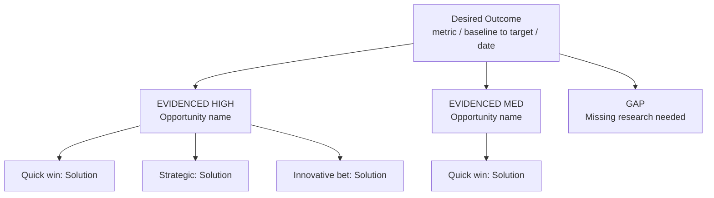

**Before starting:** present a brief work plan — what you will do and in what order — plus any clarifying questions, and wait for confirmation before proceeding.

This skill builds an evidence-grounded Opportunity Solution Tree. Every opportunity must trace to real data. If evidence is thin or missing, this skill flags the gap and tells you what research to conduct — it does not fabricate branches.

Accepts: interview transcripts, survey responses, analytics summaries, support tickets, previous research synthesis. Claude's context window handles 50+ pages of raw data.

---

## Required inputs

Ask for:
- Discovery data (paste directly or reference prior synthesis)
- Product outcome being driven (measurable)
- Current metrics and target
- Known constraints

---

## Process

### Level 1 — Outcome

Restate the desired outcome as a clear, measurable metric.

- Define exactly what is counted
- State baseline and target with time horizon
- Identify leading indicator(s) if the lagging metric moves slowly

If the stated outcome is vague, a vanity metric, or not directly influenceable by product, push back and propose 1–3 better formulations before continuing.

---

### Level 2 — Opportunities

From the discovery data, identify distinct customer needs, pain points, or desires that — if addressed — would drive the outcome.

For each opportunity:
- Frame as a customer opportunity, not a solution: "Users struggle to X" NOT "Add feature Y"
- Group related opportunities under parent themes
- Cite supporting evidence with direct quote and source reference
- Rate confidence: High / Medium / Low based on data strength
- Flag opportunities that seem important but lack sufficient data validation — note what research would close the gap

**Hard rule:** Do NOT generate opportunities from general knowledge. If the data doesn't support it, leave a gap and name the missing research.

---

### Level 3 — Solutions

For each high-confidence opportunity, generate 3+ solutions:

- **Quick win** — minimal effort, immediate learning
- **Strategic investment** — higher effort, compounding value
- **Innovative bet** — riskier, potentially transformative

Keep solutions clearly separated from opportunities. These are distinct tree levels.

---

### Level 4 — Assumption Tests

For each top solution, identify the riskiest assumption and propose a lightweight experiment:

- **Hypothesis:** "We believe [action] will [outcome] for [user segment] because [rationale]"
- **Test:** cheapest, fastest method to validate or invalidate
- **Decision criteria:** what result makes you proceed vs. pivot

Every experiment must be completable in under 2 weeks with minimal engineering.

---

## Output format

Always output the OST as a Mermaid flowchart (top-down). Use this structure:

Use `flowchart TD` only — not mindmap. FigJam and Notion both render this format and it exports cleanly to SVG. Keep node labels short. Full analysis goes in prose below the diagram.

---

## Constraints

- Never fabricate evidenced opportunities — missing data means a GAP label, always
- Keep solutions and opportunities at distinct levels — never collapse them
- Every experiment must be completable in under 2 weeks with minimal engineering
- If the outcome is not influenceable by product, challenge it before proceeding
- Distinguish between what participants SAID they want and what their behavior reveals

---

## File output

Save the completed OST (Mermaid diagram + full prose analysis) as `[project-slug]-OST.md` in the current working directory.

Confirm save with: `Saved: [filename]`

Display the full document inline after saving.

---

## Progressive Updates

Whenever the user explicitly states not to do something (e.g. "don't ask for X", "stop doing Y", "never include Z"), automatically edit the role and behaviour description at the top of this SKILL.md to reflect that constraint permanently. This ensures the skill adapts to user preferences over time without requiring repeated instructions.
