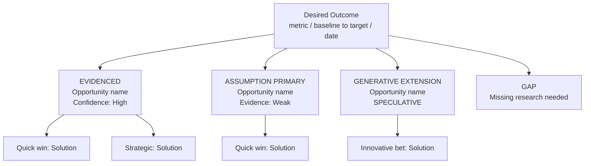

**Before starting:** present a brief work plan — what you will do and in what order — plus any clarifying questions, and wait for confirmation before proceeding.

This skill builds an Opportunity Solution Tree when discovery data is thin or absent, or when you want to push beyond what evidence alone suggests. It runs two modes in parallel:

- **Occam's razor** — prefer the simplest hypothesis that fits available evidence
- **Generative extension** — if an assumption is true, what's the most interesting place it leads?

Evidenced claims and speculative extensions are always clearly labeled. This is an exploration tool, not a synthesis tool. Use `ost-evidence` when you have real customer data.

---

## Required inputs

Ask for:
- Strategic context: product outcome, current metrics, target, constraints
- Any available data (even weak signals count)
- Adjacent domains or analogies already considered (optional)
- Whether to run assumption-only mode or hybrid (some data + assumptions)

---

## Process

### Level 1 — Outcome

Restate the desired outcome as a measurable metric:
- Metric definition, baseline, target + time horizon
- Leading indicator(s) if the lagging metric moves slowly

If vague or unmeasurable, push back and propose 1–3 better formulations before continuing.

---

### Level 2A — Evidenced Opportunities

If any data exists, extract opportunities grounded in it:
- Frame as opportunities ("Users struggle to…"), not solutions
- Cite evidence: direct quote + source
- Rate confidence: High / Medium / Low
- State impact link: why this would move the outcome

---

### Level 2B — Assumption Opportunities

When data is missing or thin, generate assumption-based opportunities:

For each:
- Write as an opportunity hypothesis, not a solution
- State the assumption explicitly: "We assume X because Y"
- Assign:
  - Evidence strength: None / Weak signal / Indirect / Strong
  - Risk: Low / Med / High
  - Testability: Easy / Medium / Hard within 2 weeks
- Apply **Occam's razor**: prefer the simplest hypothesis that explains available evidence. If multiple fit, list alternatives and mark the simplest as PRIMARY.

**Generative Extension** — for each assumption that survives Occam's razor:
- "If this assumption is entirely true, what's the most ambitious opportunity it unlocks?" → label `GENERATIVE EXTENSION`
- "Does an adjacent domain solve an analogous problem? What's the simplest version in our context?" → label `ANALOG IMPORT`
- Mark all extensions: `[SPECULATIVE — needs validation]`
- These exist to expand the solution space before converging. They are not claims.

---

### Level 3 — Solutions

For each opportunity (evidenced first, then best assumption opportunities including generative extensions):

- **Quick win** — low effort, fast to learn
- **Strategic investment** — compounding value
- **Innovative bet** — riskier, transformative (especially for GENERATIVE EXTENSION branches)

For innovative bets from generative extensions: include a **minimum believable version** — the smallest form of this idea that would still be meaningfully different from existing solutions.

For each solution, assign an **Occam score**: 1 (very simple) → 5 (complex). Prefer lower scores at equal impact.

---

### Level 4 — Assumption Map

For each solution, categorize assumptions:
- **Desirability** — users want it
- **Usability** — users can use it
- **Feasibility** — we can build and operate it
- **Viability** — it helps the business

Mark the **riskiest assumption** to test first.
Mark the **most generative assumption** — if validated, this opens the largest new opportunity space. Worth testing even if it seems unlikely.

---

### Level 5 — Tests

For the riskiest assumption AND the most generative assumption:

- **Hypothesis:** "We believe [action] will [result] for [segment] because [reason]"
- **Method:** prototype / concierge / landing page / survey / log analysis / customer calls
- **Success criteria:** numeric threshold or clear decision rule
- **Next decision:** proceed / iterate / stop

For generative assumptions: include a **signal to watch for** — a weak signal in early results that would suggest this assumption has more potential than the primary hypothesis confirms.

---

## Output format

Always output the OST as a Mermaid flowchart (top-down). Use this structure:

Use `flowchart TD` only — not mindmap. FigJam and Notion both render this format and it exports cleanly to SVG. Keep node labels short. Full analysis goes in prose below the diagram.

---

## Constraints

- Never fabricate evidenced opportunities — missing data → Assumption branch, always
- Keep opportunities and solutions at distinct levels
- Label every branch: EVIDENCED / ASSUMPTION / GENERATIVE EXTENSION / ANALOG IMPORT
- Generative extensions are speculative — never present them as validated
- Every test must be completable in under 2 weeks with minimal engineering
- Occam's razor applies to assumption selection, not to generative extensions
- If no discovery data is provided, proceed in assumption-only mode and note which sections require future research

---

## Progressive Updates

Whenever the user explicitly states not to do something (e.g. "don't ask for X", "stop doing Y", "never include Z"), automatically edit the role and behaviour description at the top of this SKILL.md to reflect that constraint permanently. This ensures the skill adapts to user preferences over time without requiring repeated instructions.
